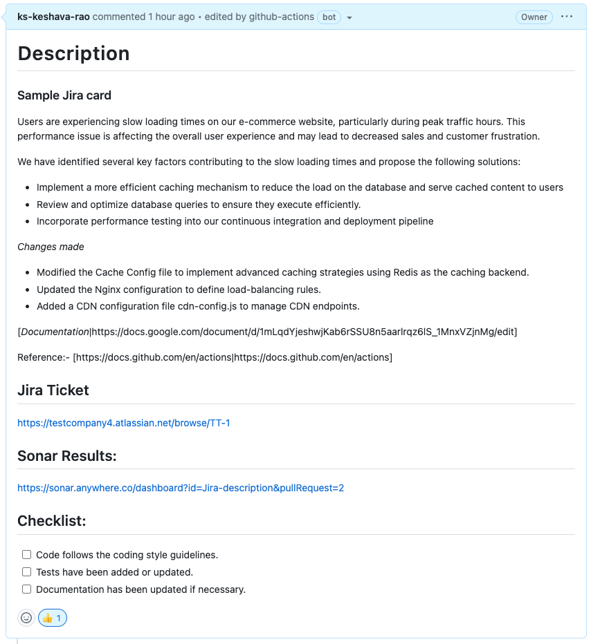
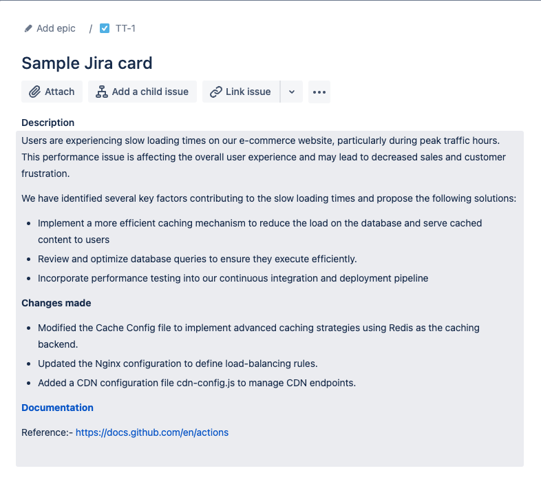

# @ks-keshava-rao/Jira-description

### Github action to integrate your Jira ticket description to the associated pull request description.

Pull Request Description      |   Jira Ticket         
:-------------------------:|:-------------------------:
 | 

## Example Workflow 
- Create a file `Jira-pr-action.yml` in the `.github/workflows` directory in your repository with the following content:
  
```yaml
name: Update PR Description from Jira 
on:
 pull_request:
   types: [opened , reopened]

jobs:
 update_pr_description:
   runs-on: ubuntu-latest

   steps:
     - name: Checkout repository
       uses: actions/checkout@v2

     - name: Update PR description 
       id: update_description
       uses: ks-keshava-rao/Jira-description@v1
       with:
          token: ${{secrets.GITHUB_TOKEN}} # required
          jiraId: ${{steps.extract_branch_name.outputs.jira_id}} # required
          orgUrl: https://testcompany.atlassian.net # required
          jiraToken: ${{secrets.JIRA_API_TOKEN}} # required
          jiraUsername: ${{secrets.JIRA_USERNAME}} # required
          sonarQubeUrl: https://sonar.testcompany.co # optional
```
## Inputs

| Name | Description | Example | Required |
| --- | --- | --- | --- |
| `token` | Automatically generated repo scoped token, provided by Github by default. configure read and write [permissions](https://github.blog/changelog/2021-04-20-github-actions-control-permissions-for-github_token/#setting-the-default-permissions-for-the-organization-or-repository) for the workflow. | ${{ secrets.GITHUB_TOKEN }} | Yes |
| `jiraId` | Jira issue id or Jira ticket id for the associated jira issue, can be extracted from a step in a job or obtained by any other way . | ${{steps.extract_branch_name.outputs.jira_id}} or `SWT-328` | Yes |
| `orgUrl` | Organisation's sub-domain for Jira .| https://sub-domain.atlassian.net | Yes |
| `jiraToken` | Project scoped Jira API token for Authorization. [check here](#jira-authorization-credentials) for configuring the Jira API token into your Repo | ${{secrets.JIRA_API_TOKEN}} | Yes |
| `jiraUsername` | Email address or  username of the user account in Jira from which the `jiraToken` was obtained  [refer](#jira-authorization-credentials) . | ${{secrets.JIRA_USERNAME}} | Yes |
| `sonarQubeUrl` | Organization's  sonarQube sub-domain for code quality and analysis if applicable .  | https://sonar.testcompany.co | No |

## Action result
The action will fail the workflow in case required input fields provided are incorrect or invalid

## jira-authorization-credentials 
1. Jira API token can be obtained from the account settings in Jira , [reference](https://support.atlassian.com/atlassian-account/docs/manage-api-tokens-for-your-atlassian-account/) .
2.  Jira API token should be added to [repository secrets](https://docs.github.com/en/actions/security-guides/using-secrets-in-github-actions#creating-secrets-for-a-repository) with the desired name for the token value .
3.  The Jira username must correspond to the email address of the user account used to generate the Jira API token. This username should be set as a secret key in the repository's secrets under the chosen name for the username value.

> [!NOTE]
> This build makes use of Jira REST API V2, which means that the Markdown formatting in Jira and GitHub pull requests may not perfectly align. While certain advanced formatting features may not translate precisely, basic elements like plain text, bullet points, and paragraphs remain consistent between the two platforms.


